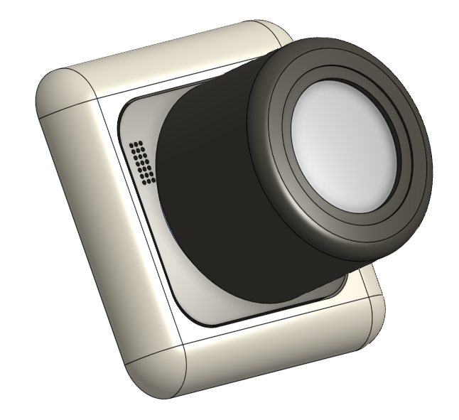

# German Smartknob
An ESP32-S3 based knob to control smart devices at home. Based on Scott Bez's Smartknob: https://github.com/scottbez1/smartknob?tab=readme-ov-file. Adapted for the standard german wall socket.

## Table of Contents
1. [About the Project](#about-the-project)
2. [Features](#features)
3. [Components](#components)
4. [Getting Started](#getting-started)
5. [Project Status](#project-status)

## About the project
This project mechatronic project has three main parts. The first part consisted of the development of a PCB that could fit in the standard german wall socket and would control sensors, touch display and a BLDC Motor. The second part consisted on 3d printed pieces to sustain the PCB on its place, allow BLDC rotation while keeping the touch display on its place. Finally the third part was the software, which tested that all sensors and actuators worked accordingly. The final product can be seen below. 
<p align="center">
   <br>
   <b>German Smartknob</b>
</p>

## Features
- ESP32-S3 based PCB
- Input Voltage of up to 24V
- Haptic Feedback with a BLDC-Motor (Coming soon)
- Touch Display
- Brightness and Temperature Sensor
- Audio speaker connectors

## Components
A summarized description of this products three main parts.
### PCB
The PCB was designed to fit into the standard german wall socket. It has two sides. 
On the front side there is a ring of RGB Leds for user feedback and at its center a magnetic encoder. The magnetic encoder is key to detect the rotation's direction of the BLDC Motor, that in this project is used as an input device, similar to a rotary encoder. The reason why a BLDC Motor was chosen and not a regular rotary encoder, is because with the first, through proper driver, it is possible to program the motor's torque and adjust it according to the user's use. Besides of this, at the sides of the Front-PCB there are sensors to detect the temperature, the room's brightness and also output audio via a speaker.
On the back side there are connectors available to supply the PCB with 24V, 3.3v and extra outputs with I2C and CAN lines. The Display connector pads, the ESP32-S3, and the audio and bldc driver are also found on the back side of the PCB.
Below the two faces of the PCB.


<p align="center">
    
   
</p>

### 3D printed Parts

### Software


## Getting Started

### Download this repo
```
git clone https://github.com/LucasCanete/GermanSmartknob.git
```
### Build and upload 


### How To Use
The Kitchenalarm has a **Rotary Encoder** that lets you configure the Minutes and Seconds through the encoder's rotation.
1. Press the Rotary Encoder on the board to configure the Minutes and adjust it rotating the encoder 
2. Press it once again to configure the Seconds and rotate it to adjust 
3. Press the encoder one last time to activate the Timer with the Minutes and Seconds you configured in step 1 and step 2. The Timer will start counting down on the 7-Segment Display (To reset the countdown press the Encoder)
4. When the Timer reaches 00:00 (on the Display) the buzzer on the Board will start beeping. Your pizza is ready. Press the Encoder once to stop the beeping
5. The Kitchenalarm goes automatically to deep sleep if it is not given instructions. To wake it up just press the Encoder


<p align="center">
    
   
</p>

## Project Status
This project is still under development. Eventhough the first version was successful, improvements are still coming to the software side. Some of them are:
- [ ] Full implementation of haptic feedback
- [ ] Connection to smart devices over MQTT, home assistant, etc
